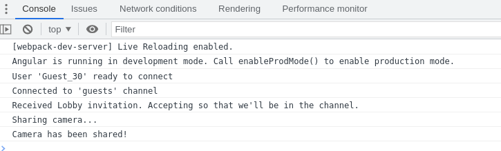

# Horn + Angular example

This one used basic [angular app](https://angular.io/guide/setup-local#create-a-workspace-and-initial-application) example.

In the `src/app/app.component.html` add the following button the the markup:

```html
<button (click)="connectToHorn()">Connect to Horn</button>
```

and define the `connectToHorn` method in the `src/app/app.component.ts` (make sure you replace `__CHANNEL_UUID__` with the
actual UUID of your channel):

```javascript
import {
  HornConnection,
  HornConfiguration,
  AuthenticationService,
  VideoService,
  ChannelsService
} from '@horn/api';

export class AppComponent {
  ...
  async connectToHorn() {
    try {
      // Define channel UUID we want to connect to. Important thing: this channel has to allow
      // for guests user login if we want to connect to it in this example
      const channelId = '__CHANNEL_UUID__';
      const clientId = (await ChannelsService.getClientId(channelId)).id
      // Create a new guest user to connect to our channel
      const guestName = `Guest_${Math.floor(Math.random() * 100) + 1}`
      const guest = await AuthenticationService.createGuestUser(
        clientId,
        channelId,
        guestName
      )
      console.log(`User '${guestName}' ready to connect`);
      HornConfiguration.configure({
        authToken: guest.token
      });
      // Initialize new connection and configure it so that it'll connect to our channel
      const connection = HornConnection.get();
      connection.configure(channelId)
      connection.onConnected(() => {
        console.log(`Connected to '${connection.getChannelDetails().channelName}' channel`);
      });
      connection.onDisconnected((reason) => {
        console.log('Disconnected. Reason: ' + reason);
      });
      // Auto-accept Lobby invitation to get straight into the channel once user gets invited
      connection.onInvited(() => {
        console.log(`Received Lobby invitation. Accepting so that we'll be in the channel.`);
        connection.getAPI().acceptInvitation();

        // Once we're in the channel, start sending camera stream after 2 seconds
        window.setTimeout(async () => {
          const firstCameraSource = VideoService.get().getAvailableVideoSources().find((s) => s.type === "camera");
          if(firstCameraSource) {
            console.log(`Sharing camera...`);
            await VideoService.get().startVideoSending(firstCameraSource)
            console.log(`Camera has been shared!`);
          } else {
            console.warn(`Couldn't find camera source to share.`);
          }
        }, 2000)
      })

      // Run the connection
      await connection.start();

    } catch (e) {
      console.error(`Connecting to Horn's channel failed`, e);
    }
  }
}

```

now, simply run the app:

```
ng serve --open
```

and click the `Connect to Horn` button :rocket:!

In a few seconds you should see the guest user in the channel and similar output in the browser console:



